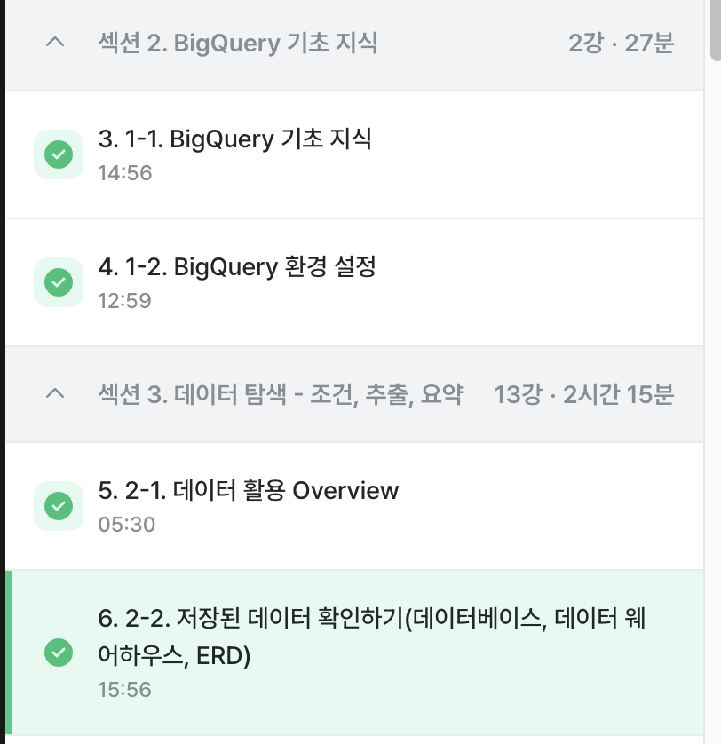

# SQL_BASIC 1주차 정규 과제 

📌SQL_BASIC 정규과제는 매주 정해진 분량의 `초보자를 위한 BigQuery(SQL) 입문` 강의를 듣고 간단한 문제를 풀면서 학습하는 것입니다. 이번주는 아래의 **SQL_Basic_1st_TIL**에 나열된 분량을 수강하고 `학습 목표`에 맞게 공부하시면 됩니다.

**👀(수행 인증샷은 필수입니다.)** 

## SQL_BASIC_1st_TIL

### 섹션 2. BigQuery 기초 지식

### 1-1. BigQuery 기초 지식

### 1-2. BigQuery 환경 설정

## 섹션 3. 데이터 탐색 - 조건, 추출, 요약

### 2-1. 데이터 활용 Overview 

### 2-2. 저장된 데이터 확인하기

## 🏁 강의 수강 (Study Schedule)

| 주차  | 공부 범위              | 완료 여부 |
| ----- | ---------------------- | --------- |
| 1주차 | 섹션 **1-1** ~ **2-2** | ✅         |
| 2주차 | 섹션 **2-3** ~ **2-5** | 🍽️         |
| 3주차 | 섹션 **2-6** ~ **3-3** | 🍽️         |
| 4주차 | 섹션 **3-4** ~ **4-4** | 🍽️         |
| 5주차 | 섹션 **4-4** ~ **4-9** | 🍽️         |
| 6주차 | 섹션 **5-1** ~ **5-7** | 🍽️         |
| 7주차 | 섹션 **6-1** ~ **6-6** | 🍽️         |

 

<!-- 여기까진 그대로 둬 주세요-->

---

# 1️⃣ 개념정리 
<!-- 강의 수강 이후에 아래의 학습 목표에 맞게 개념을 자유롭게 정리해주세요.-->
## 1-1. BigQuery 기본지식

~~~
✅ 학습 목표 :
* 데이터 관련 기초 지식(OLTP, SQL, Row, Column, 저장 형태 등)을 설명할 수 있다. 
* BigQuery 관련 기초 지식에 대해서 파악할 수 있다. 
~~~
데이터는 보통 데이터 베이스 테이블 등에 저장 

Database: 데이터의 저장소 

Table: 데이터가 저장된 공간

저장된 Data를 제품(앱/웹)에서 사용 

데이터가 저장되는 장소: My SQL, Oracle, Postgre SQL 같은 데이터 베이스에 주로 저장. 

--> 얘네 같은 데이터 베이스는 OLTP(Online Transaction Processing) 라고 함.

*OLTP*
-거래를 하기 위해 사용되는 DB
-보류나 중간 상태가 없음. 주문을 완료하거나 안하거나 상태임. 데이터가 무결함.
-데이터의 추가(INSERT), 데이터의 변경(UPDATE)이 많이 발생
-SQL을 사용해 데이터를 추출할 수 있으나 분석을 위해 만든 데이터 베이스가 아니라 쿼리 속도가 느릴 수 있음. (거래나 서비스에서 주로 이용됨)

*SQL*
-데이터 베이스에서 데이터를 가지고 올때 사용하는 언어.
-데이터 베이스의 데이터를 관리하기 위해 설계된 특수 목적의 프로그래밍 언어.
-쿼리문,쿼리구문,쿼리를짠다,SQL쿼리 등으로 표현함.

*행(ROW)*
-새로운 row는 가로줄 한줄을 의미 
-하나의 row가 하나의 고류한 데이터. 
ex. 거래 history에서 보통 하나의 row가 거래.
주의) Raw 데이터 : 원본 데이터 

*열(Column)*
-column은 원형기둥이라는 뜻. 세로로 연상
-각 데이터의 특정 속성 값.
-거래의 구매시간, 거래의 구매자

*OLAP*
OLTP로 데이터 분석을 하다가 속도, 기능 부족 이슈로 OLAP가 등장함. 
OLAP (Online Analytical Prosessing)
-분석을 위한 기능 제공

*데이터 웨어하우스*
-데이터를 한 곳에 모아서 저장하는 일종의 창고 
-여러곳에 저장된 데이터 예시
-Database, 웹(크롤링), 파일(CSV), API의 결과 등.. 

=구글 클라우드의 OLAP + 데이터 웨어하우스가 => Big Query
=> 구글 클라우드의 데이터 웨어하우스

## 2-1. 데이터 활용 Overview

~~~
✅ 학습 목표 :
* 데이터를 활용하는 과정을 설명할 수 있다.
* 데이터를 탐색하는 과정으로 조건과 추출, 요약을 할 수 있다. 
~~~
*데이터를 활용하는 과정
어떤일을 해야한다 (문제정의를해야함MECE) -> 원하는 것을 정한다 -> 데이터 탐색
데이터 탐색 -> 단일자료 / 다량의 자료 -> (여러가지 자료를 볼 때는 이것들을 연결하는 과정이 필요하다) -> 조건(필터링) / 추출 / 변환 / 요약

--> 데이터 결과 검증 (내가 예상한 것과 실제가 동일한가?)
--> 피드백 / 활용

*SQL을 사용하는 부분*
데이터를 탐색하고 --> 데이터 결과를 검증하는 부분!!

## 2-2. 저장된 데이터 활용하기

~~~
✅ 학습 목표 :
* 데이터가 저장되는 형태를 알고 저장된 데이터를 활용할 수 있다. 
~~~

SQL 쿼리를 작성하기 전에 
-데이터가 어떻게 저장되어 있는가? 에 대해 생각해보기
-어떤 데이터가 저장되어 있는가?
-컬럼의 의미는 무엇인가? 

데이터를 제대로 이해해야 올바른 데이터를 추출할 수 있음
(구체적인 정의를 항상 확인하면서 쿼리를 작성해야함)

--> 데이터를 추출하기 전에 데이터 웨어하우스에 데이터가 어떻게 저장되어 있는지 확인하는 과정이 필요하다. 

데이터가 저장되는 형태를 알려면 ERD를 활용한다.

회사에 존재할 수 있는 데이터 예시
1) 서비스에 사용될 데이터 베이스 
-유저테이블
-배송테이블
-물건테이블
: 보통 결과를 알 수 있는 데이터임. / 거의 다 회사에서 가지고 있음

2) 앱/웹 로그 데이터 
-유저가 앱/웹에 들어와서 회원가입-페이지 확인,컨텐츠 확인 등등의 데이터
-"과정"을 알 수 있는 데이터 

3) 공공 데이터, 서드파티 데이터
-날씨 
-페이스북 광고 데이터

---
# 2️⃣ 학습 인증란

 
 

---

# 3️⃣ 확인문제

## 문제 1
**🧚Q. 포켓몬 게임이나 이커머스 산업과 같이 다양한 산업에서는 각기 다른 데이터가 존재합니다. 다음 중 하나의 산업을 선택하고, 해당 산업에서 수집하고 활용될 수 있는 데이터 항목 (칼럼) 5가지를 자유롭게 상상하여 나열해보세요.**

> 중고거래 앱(유저네임, 관심상품카테고리, 거래횟수, 관심상품목록갯수, 앱사용시간 )

## 문제 2
**🧚Q. 이번 강의를 통해 SQL이 왜 필요하다고 느끼는지, SQL을 통해 본인이 어떤 것을 해내고 싶은지를 자유롭게 작성해보세요.**

데이터를 다루고 싶은 사람이라면 기본적으로 SQL 역량이 필요하다는 생각이 들었습니다. 필요한 정보를 직접 찾아보고 데이터를 정리해서 한눈에 비교할 수 있어 여러 직무에서 필요로 하는 이유도 알게되었습니다. 
앞으로 SQL을 활용해 제가 관심있는 법률 관련 데이터를 뽑아 간단한 결과를 만들어 제 의견을 근거 있게 말할 수 있는 능력을 키우고 싶습니다.

### 🎉 수고하셨습니다.

