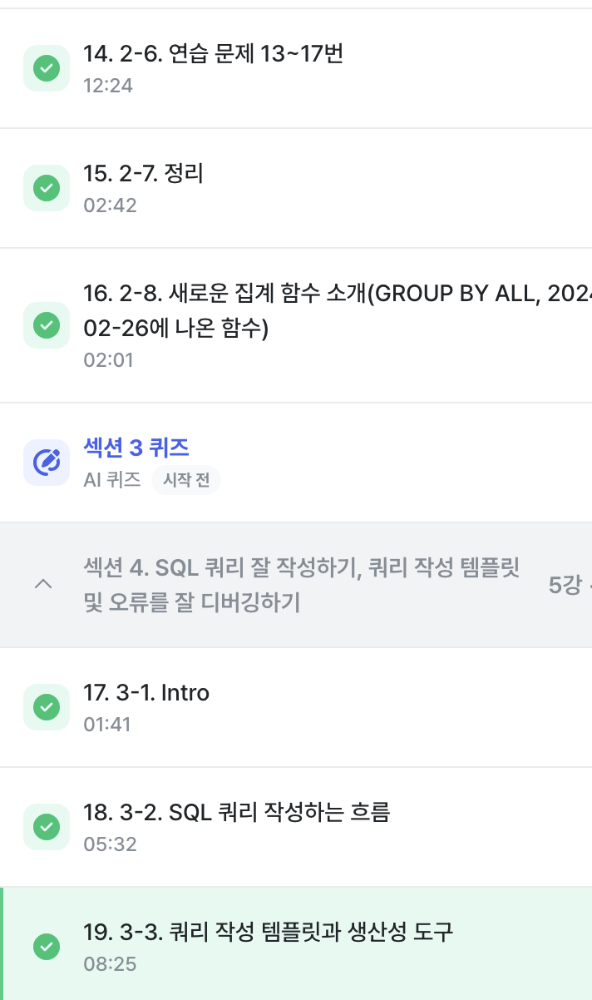

# SQL_BASIC 3주차 정규 과제 

📌SQL_BASIC 정규과제는 매주 정해진 분량의 `초보자를 위한 BigQuery(SQL) 입문` 강의를 듣고 간단한 문제를 풀면서 학습하는 것입니다. 이번주는 아래의 **SQL_Basic_3rd_TIL**에 나열된 분량을 수강하고 `학습 목표`에 맞게 공부하시면 됩니다.

**3주차 과제는 문제 풀이를 중심으로**, 강의에서 제시된 예제 문제 중 **7 문제 이상을 선택하여 직접 풀어본 뒤**, 강의 영상의 풀이와 비교해 **틀린 부분, 맞은 부분, 새롭게 배운 개념**을 구체적으로 정리해주세요. (적어도 3문제는 정리해야 합니다.) 완성된 과제는 Gihub에 업로드하고, 링크를 스프레드시트 'SQL' 시트에 입력해 제출해주세요.

**👀(수행 인증샷은 필수입니다.)** 

## SQL_BASIC_3rd

### 섹션 3. 데이터 탐색 - 조건, 추출, 요약

### 2-6. 연습문제 1~3번

### 2-6. 연습문제 7~9번

### 2-6. 연습문제 10~12번

### 2-6. 연습문제 13~17번

### 2-7. 정리 

### 2-8. 새로운 집계함수

## 섹션 4. 쿼리 잘 작성하기, 쿼리 작성 템플릿 및 오류를 잘 디버깅하기

### 3-1. INTRO

### 3-2. SQL 쿼리 작성하는 흐름

### 3-3. 쿼리 작성 템플릿과 생산성 도구 

## 🏁 강의 수강 (Study Schedule)

| 주차  | 공부 범위              | 완료 여부 |
| ----- | ---------------------- | --------- |
| 1주차 | 섹션 **1-1** ~ **2-2** | ✅         |
| 2주차 | 섹션 **2-3** ~ **2-5** | ✅         |
| 3주차 | 섹션 **2-6** ~ **3-3** | ✅         |
| 4주차 | 섹션 **3-4** ~ **4-4** | 🍽️         |
| 5주차 | 섹션 **4-4** ~ **4-9** | 🍽️         |
| 6주차 | 섹션 **5-1** ~ **5-7** | 🍽️         |
| 7주차 | 섹션 **6-1** ~ **6-6** | 🍽️         |

 

<!-- 여기까진 그대로 둬 주세요-->

---

# 1️⃣ 개념정리

## 2-6. 연습문제

~~~
✅ 학습 목표 :
* 연습문제(7문제 이상) 푼 것들 정리하기
~~~

1. 
SELECT
  COUNT(id) AS cnt
FROM basic.pokemon
WHERE
  type2 IS NULL;

## type2 값이 비어 있는 포켓몬만 골라서 전체 개수를 세기

2. 
SELECT
  type1,
  COUNT(id) AS cnt
FROM basic.pokemon
WHERE
  type2 IS NULL
GROUP BY
  type1
ORDER BY
  cnt DESC;

##type2가 없는 포켓몬만 대상으로 type1별 개수를 구하고, 많은 순으로 정렬

3.
SELECT
  type1,
  COUNT(id) AS cnt
FROM basic.pokemon
GROUP BY
  type1;

##전체 포켓몬을 대상으로 type1별 포켓몬 수를 집계

4.
SELECT
  is_legendary,
  COUNT(id) AS cnt
FROM basic.pokemon
GROUP BY
  is_legendary;

##전설 포켓몬 여부에 따라 포켓몬 수를 집계

5.
SELECT
  *
FROM basic.trainer
WHERE
  name = 'Iris';

##basic.trainer 테이블에서 이름이 Iris인 트레이너의 정보를 조회

6. 
SELECT
  *
FROM basic.trainer
WHERE
  name IN ('Iris', 'Whitney', 'Cynthia');

##름이 Iris, Whitney, Cynthia인 트레이너들의 정보를 한 번에 조회

## 2-8. 새로운 집계함수

~~~
✅ 학습 목표 :
* SQL 쿼리 구조를 이해할 수 있다. 
* SELECT, FROM, WHERE을 활용하는 방법을 설명할 수 있다. 
~~~

GROUP BY ALL
: 집계 대상이 아닌 컬럼들을 기준으로 자동 그룹화.

## 3-2. 쿼리를 작성하는 흐름

~~~
✅ 학습 목표 :
* 쿼리를 작성하는 흐름을 설명할 수 있다.
~~~

1. 지표를 고민--> (지표를 고민하는 시점에서)--> 어떤 문제를 해결하기 위해 데이터가 필요한지 생각하기
2. 지표 구체화 --> 추상적이지 않고 구체적인 지표 명시 (분자,분모표시) 
3. 지표탐색 --> 회사에서 유사한 문제를 해결한 케이스가 있나 확인 --> (존재) --> 해당 쿼리 리뷰
4. 쿼리 작성 --> 데이터가 있는 데이블 찾기 -1개(그냥활용) / 2개이상 (연결방법 고민하기 - join등)
5. 데이터 정합성 확인 --> 예상한 결과와 동일한지 확인 
6. 쿼리 가독성 --> 나중을 위해 깔끔하게 쿼리 작성
7. 쿼리 저장 --> 쿼리는 재사용되므로 문서로 저장 
**반복이 중요**

## 3-3. 쿼리 작성 템플릿과 생산성 도구

~~~
✅ 학습 목표 :
* 생산성 도구를 만들 수 있다.
~~~

##쿼리 작성 템플릿
-쿼리를 작성하는 목표, 확인할 지표
-쿼리 계산 방법
-데이터의 기간
-사용할 테이블
-join key
-데이터 특징

--> 템플릿을 사용하자라고 하면 생기는 일
: 템플릿을 사용하는 것을 까먹음 => 습관 형성이 되지 않음. 이 부분을 개선하기 위해 생산성 도구를 활용. 
**Espanso 
-특정 단어를 입력하면 원하는 문장(템프릿)으로 바로 변경하능한 도구.!!

 
 

---

# 2️⃣ 학습 인증란

  

---

# 3️⃣ 확인문제

## 문제 1

> **🧚Q. Q. 포켓몬 연구에 흥미를 느낀 혜인은 각 타입(type1)별 평균 공격력(attack)을 비교해보고 싶었습니다.**
>
> 그래서 다음과 같은 필요한 정보를 미리 정리해보았습니다. 

~~~
조건 : attack이 50 이상인 포켓몬만 포함
보고 싶은 컬럼 : type1
집계 내용 : 각 type1 별 평균 공격력
정렬 기준 : 평균 공격력을 기준으로 내림차순 정렬
~~~

> **이 목표를 바탕으로 혜인은 아래와 같은 쿼리를 작성했지만, 일부 SQL 문법 요소를 빼먹었습니다. 비어 있는 부분인 ㄱ, ㄴ, ㄷ, ㄹ 에 들어갈 알맞은 SQL 구문을 채워보세요:**

~~~sql
SELECT type1, (ㄱ)
FROM pokemon
(ㄴ) attack >= 50
(ㄷ) type1
ORDER BY (ㄱ) (ㄹ);
~~~

~~~
ㄱ:AVG(attack)
ㄴ:WHERE
ㄷ: GROUP BY
ㄹ: DESC
~~~

### 🎉 수고하셨습니다.