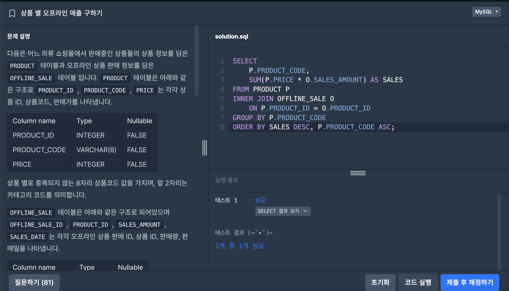
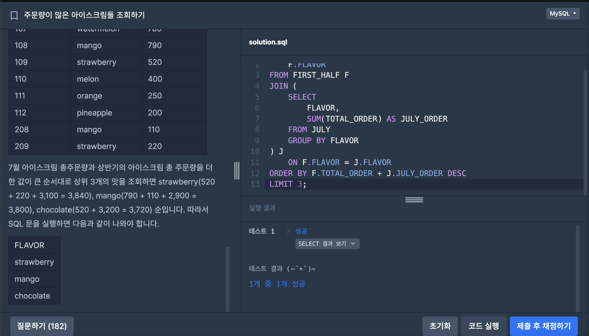

# SQL_BASIC 6주차 정규 과제 

📌SQL_BASIC 정규과제는 매주 정해진 분량의 `초보자를 위한 BigQuery(SQL) 입문` 강의를 듣고 간단한 문제를 풀면서 학습하는 것입니다. 이번주는 아래의 **SQL_Basic_6th_TIL**에 나열된 분량을 수강하고 `학습 목표`에 맞게 공부하시면 됩니다.

**6주차 과제는 강의 내용을 정리하는 것과 함께, 프로그래머스에서 제공하는 SQL 문제를 직접 풀어보는 실습도 병행합니다.** 강의에서는 **배운 내용을 정리하고 주요 쿼리 예제를 정리**하며, 프로그래머스 문제는 **직접 풀어본 뒤 풀이 과정과 결과, 배운 점을 함께 기록**해주세요. 완성된 과제는 Github에 업로드하고, 링크를 스프레드시트 'SQL' 시트에 입력해 제출해주세요.

**👀(수행 인증샷은 필수입니다.)** 

## SQL_BASIC_6th

### 섹션 6. 다량의 자료를 연결 : JOIN 

### 5-1. Intro

### 5-2. JOIN 이해하기

### 5-3. 다양한 JOIN 방법

### 5-4. JOIN 쿼리 작성하기 

### 5-5. JOIN을 처음 공부할 때 헷갈렸던 부분

### 5-6. JOIN 연습문제 1~2번

### 5-6. JOIN 연습문제 3~5번

### 5-7. 정리


## 🏁 강의 수강 (Study Schedule)

| 주차  | 공부 범위              | 완료 여부 |
| ----- | ---------------------- | --------- |
| 1주차 | 섹션 **1-1** ~ **2-2** | ✅         |
| 2주차 | 섹션 **2-3** ~ **2-5** | ✅         |
| 3주차 | 섹션 **2-6** ~ **3-3** | ✅         |
| 4주차 | 섹션 **3-4** ~ **4-4** | ✅         |
| 5주차 | 섹션 **4-4** ~ **4-9** | ✅         |
| 6주차 | 섹션 **5-1** ~ **5-7** | ✅         |
| 7주차 | 섹션 **6-1** ~ **6-6** | 🍽️         |

<!-- 여기까진 그대로 둬 주세요-->

<br>

---

# 1️⃣ 개념정리

## 5-2. JOIN 이해하기

~~~
✅ 학습 목표 :
* JOIN에 대한 정의와 필요성에 대해 설명할 수 있다.
~~~

- JOIN : 서로 다른 데이터 테이블을 연결하는 것. 
- 공통적으로 존재하는 컬럼(Key)이 있다면, Join 할 수 있음. 
- 보통 id 값을 Key로 많이 사용하고, 특정 범위로 Join도 가능함. 
<br>
ex. 포켓몬으로 Join이해하기 
:연결할 수 있는 공통 데이터 찾기. / 오른쪽으로 이어 붙임. / 컬럼이 추가됨.
<br>

- 관계형 데이터 베이스(RDBMS) 설계시 정규화 과정을 거침. 
- 정규화는 중복을 최소화하게 데이터를 구조화.
- user table 은 유저 데이터만, order table은 주문데이터만
- 따라서 데이터를 다양한 Table에 저장해서 필요할 때 join해서 사용
- 데이터 웨어하우스에서 join+필요한 연산을 해서 --> 데이터 마트를 만들어서 활용함. 
## 5-3. 다양한 JOIN 방법

~~~
✅ 학습 목표 :
* JOIN 방법들의 종류를 설명할 수 있다. 
* 각 JOIN 방법들의 차이점에 대해서 설명할 수 있다. 
~~~
- (INNER) JOIN : 두 테이블의 공통 요소만 연결 

- LEFT/RIGHT (OUTER) JOIN : 왼쪽/ 오른쪽 테이블 기준으로 연결

- FULL (OUTER) JOIN : 양쪽 기준으로 연결

- CROSS JOIN : 두 테이블의 각각의 요소를 곱하기

**집합관점**으로 생각하고 사용할 것! 


## 5-4. JOIN 쿼리 작성하기 

~~~
✅ 학습 목표 :
* JOIN을 사용한 문법에 대해 이해하여 적용할 수 있다.
* JOIN 을 활용한 쿼리를 작성할 수 있다. 
~~~

테이블 확인 - 테이블에 저장된 데이터, 컬럼을 확인. <br>
기준 테이블 확인 - 가장 많이 참고할 기준 테이블 정의할 것. <br>
ex. left join을 사용한다고 하면, 어떤걸 기준으로 삼을지 정하고, row수가 적으면서 내가 넣고 싶은 정보를 포함하고 있는 것으로 고려할 것.  <br>
join key 찾기 - 여러 테이블과 연결할 key/on정리
결과 예상하기 - 결과 테이블을 예상해서 손, 엑셀로 작성(일종의 정답지 역할)
쿼리 작성/ 검증 - 예상한 결과와 동일한 결과가 나오는지 확인. 
<br>
SQL JOIN 문법

| JOIN 종류 | ON 필수 여부 | 쿼리 예시 |
|---|---|---|
| INNER JOIN | O | ```sql<br>SELECT<br>    col<br>FROM table_a AS A<br>INNER JOIN table_b AS B<br>ON A.key = B.key<br>``` |
| LEFT/RIGHT JOIN | O | ```sql<br>SELECT<br>    col<br>FROM table_a AS A<br>LEFT/RIGHT JOIN table_b AS B<br>ON A.key = B.key<br>``` |
| FULL JOIN | O | ```sql<br>SELECT<br>    col<br>FROM table_a AS A<br>FULL JOIN table_b AS B<br>ON A.key = B.key<br>``` |
| CROSS JOIN | X | ```sql<br>SELECT<br>    col<br>FROM table_a AS A<br>CROSS JOIN table_b AS B<br>``` |


## 5-6. JOIN 연습문제 1~5번 

~~~
✅ 학습 목표 :
* 연습문제(3문제 이상) 푼 것들 정리하기
~~~

#1번,트레이너가 보유한 포켓몬들은 얼마나 있는지 알 수 있는 쿼리를 작성해주세요.<br>
#쿼리를 작성하는 목표, 확인할 지표: 포켓몬들이 (이름명시) 얼마나 있는지 알고 싶다! 포켓몬 수<br>
#쿼리 계산 방법: trainer_pockemon + pockemon JOIN => 그 후에 GROUP BY 집계<br>(COUNT)<br>
#데이터의 기간: x<br>
#사용할 테이블: trainer_pockemon,pockemon<br>
#JOIN KEY: trainer_pockemon.pockemon_id = pockemon_id<br>
#데이터 특징<br>
<br>
SELECT <br>
  kor_name,<br>
  COUNT(tp.id) AS pokemon_cnt<br>
FROM (<br>
  SELECT<br>
    id,<br>
    trainer_id,<br>
    pokemon_id,<br>
    status<br>
  FROM Basic.trainer_pokemon<br>
  WHERE <br>
    status IN ("Active","Training")<br>
) AS tp<br>
LEFT JOIN Basic.pokemon AS p<br>
ON tp.pokemon_id = p.id<br>
GROUP BY kor_name<br>
ORDER BY pokemon_cnt DESC<br>
<br>
#3번,
SELECT <br>
COUNT(tp.trainer_id) AS trainer_uniq,<br>
FROM basic.trainer AS t<br>
LEFT JOIN basic.trainer_pokemon AS tp<br>
ON t.id = tp.trainer_id<br>
WHERE<br>
location IS NOT NULL<br>
AND t.hometown = tp.location<br>
<br>
#4번
<br>
SELCET<br>
FROM<br>
SELECT<br>
id,<br>
trainer_id,<br>
pokemon_id,<br>
status<br>
FROM basic.trainer_pokemon<br>
WHERE<br>
status IN ("Active", "Training")<br>
AS tp<br>
LEFT JOIN basic.pokemon AS p<br>
ON tp.pokemon_id = p.id<br>
LEFT JOIN basic.trainer AS t<br>
ON tp.trainer_id = t.id<br>
WHERE<br>
t.achivement_level = "Master"<br>
GROUP BY<br>
type1<br>
ORDER BY<br>
2 DESC<br>
LIMIT 1<br>

<br>

<br>

---

# 2️⃣ 확인문제 & 문제 인증

## 프로그래머스 문제 

https://school.programmers.co.kr/learn/courses/30/lessons/131533

> 상품 별 오프라인 매출 구하기

https://school.programmers.co.kr/learn/courses/30/lessons/133027

> 주문량이 많은 아이스크림들 조회하기





---

# 3️⃣ 참고자료

JOIN 에 대해서 그림으로 쉽게 이해할 수 있는 자료들도 있어서 첨부합니다. 아래의 블로그도 학습할 때 같이 참고해주세요.

1. https://data-marketing-bk.tistory.com/entry/SQL-JOIN-%ED%95%9C-%EB%B0%A9%EC%97%90-%EC%A0%95%EB%A6%AC-%EA%B0%9C%EB%85%90%EB%B6%80%ED%84%B0-%EC%BD%94%EB%93%9C%EA%B9%8C%EC%A7%80-%EC%9D%B4%EA%B2%83%EB%A7%8C-%EB%B3%B4%EC%9E%90


2. https://velog.io/@wijoonwu/JOIN

<br>

### 🎉 수고하셨습니다.